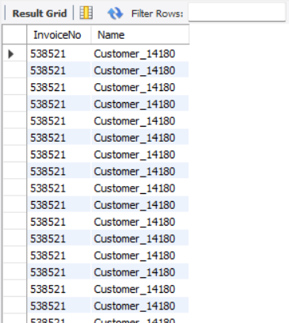

# Invoice Data SQL Query Outputs

This project demonstrates a variety of SQL operations performed on the invoice_data table within a MySQL database. The queries span data retrieval, filtering, aggregation, joins, subqueries, view creation, and indexing. Each section includes a relevant screenshot to visualize the query output and enhance understanding.

---

## 📌 Basic Data Query

*Description:* Shows the first 200 records from the `invoice_data` table to give an initial look at the dataset's structure and values.

---

## 📌 Using SELECT, WHERE, ORDER BY, GROUP BY

### ▶️ Filter by Country
*Description:* Fetches InvoiceNo and Country for records where the country is United Kingdom.

### ▶️ Quantity Filter with Ordering
*Description:* Retrieves invoices where quantity is greater than 100 and sorts by UnitPrice in descending order.

### ▶️ Group By Country with Count
*Description:* This returns the top 5 best-selling products by summing up quantities for each item description. It groups by product, sorts by total sold in descending order, and limits the output.

---

## 📌 Using JOINS

### ▶️ INNER JOIN
*Description:* Displays invoice details with customer names where matching CustomerIDs exist.

### ▶️ LEFT JOIN
*Description:* Retrieves all invoices and adds customer names if available.

### ▶️ RIGHT JOIN
*Description:* Retrieves all customers and adds invoice details if available.

---

## 📌 Subqueries

### ▶️ Customers from UK
*Description:* Retrieves all invoice records where the customer is from France using a subquery.

### ▶️ Latest Invoice Date
*Description:* Finds invoice records from the latest available date.

---

## 📌 Aggregate Functions

### ▶️ Average Order Value
*Description:* Calculates the total and average order value for each invoice.

---

## 📌 Using Views

### ▶️ Average Spend per Customer
*Description:* A view showing the average amount spent by each customer.

---

## 📌 Query for Indexing

*Description:* A simple query to fetch the first row, used to trigger indexing or performance checks.

---

## ✅ Conclusion

This repository offers a comprehensive walkthrough of SQL query techniques using a real-world invoice dataset. Through code and visuals, it provides a practical understanding of essential SQL operations including joins, subqueries, aggregates, and performance optimization strategies.
